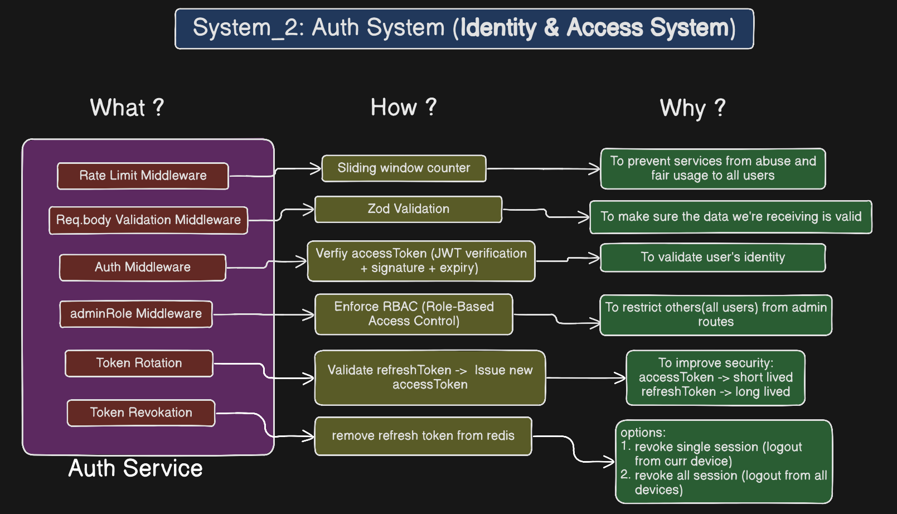
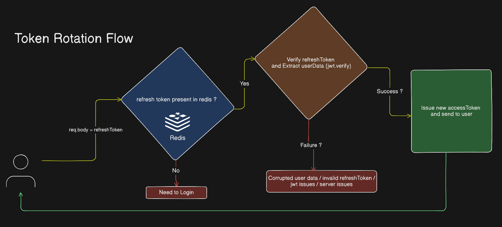

# 🔐 Auth Service – Secure Token-Based Authentication System

A production-focused authentication microservice built with **Node.js, Express, TypeScript, Zod, JWT, Redis, OAuth 2.0, and Pino logging**.

This service implements secure token rotation, Redis-backed session validation, OAuth login, RBAC, and realistic load-tested authentication flows.

Designed to simulate real-world authentication architecture and performance tradeoffs.

---

## 🌍 Live Deployment

This service is deployed and publicly accessible.

**Live URL:**    [auth_service](https://auth-service-kwdl.onrender.com/auth_service)

Hosted on **Render** with Redis cloud backend.

> Deployed environment mirrors local configuration (JWT + Redis-backed session validation).

---

## 🚀 Features

* 🔑 Access & Refresh Token Authentication (separate secrets)
* 🔁 Refresh Token Rotation
* 🗑 Session Invalidation (single session & all sessions)
* 🌐 OAuth 2.0 (Google & GitHub)
* 🛡 JWT-based Route Protection
* 👑 Role-Based Access Control (Admin middleware)
* ⚡ Redis-backed session validation
* 📉 Pluggable Rate Limiting middleware (sliding window)
* 🧪 98 Automated Tests (87 Unit + 11 Integration)
* 📊 Load tested using Autocannon
* 📜 Structured logging using Pino

---

## 🏗 Architecture Overview

> 📌 Diagram: Feature overview
> 
> 📌 Diagram: Token Rotation Flow
> 

### Core Principles

* Access tokens are short-lived JWTs.
* Refresh tokens are long-lived and validated against Redis.
* Refresh token must exist in Redis to be considered valid.
* Session invalidation removes refresh tokens from Redis.
* Admin routes enforce RBAC via role middleware.
* Logging is handled via Pino for structured JSON logs.

---

## 🔐 Authentication Flow

### 1️⃣ Login (`POST /api/auth/login`)

* Validate request body
* Compare password using bcrypt
* Issue:

  * Short-lived Access Token
  * Long-lived Refresh Token
* Store refresh token in Redis (session tracking)

---

### 2️⃣ Refresh Token Rotation (`GET /api/token/refresh`)

* Check existence in Redis
* Validate refresh token
* Verify JWT signature & expiry
* Issue new access token
* Return updated credentials

---

### 3️⃣ Session Invalidation

* `/invalidate` → Logout current device
* `/invalidate/all` → Logout from all devices

---

### 4️⃣ Protected & Admin Routes

* `/api/user/protected` → Requires valid access token
* `/api/user/admin` → Requires valid token + admin role

---

## 🛠 Tech Stack

* **Node.js**
* **Express.js**
* **TypeScript**
* **JWT (jsonwebtoken)**
* **Redis (ioredis)**
* **bcrypt**
* **zod (schema validation)**
* **OAuth 2.0 (Google & GitHub)**
* **Jest (Unit & Integration Testing)**
* **Pino (Structured Logging)**

---

## 📂 Project Structure

```
src/
 ├── config/
 ├── middlewares/
 ├── modules/
 │   ├── auth/
 │   ├── token/
 │   └── user/
 └── utils/
```

* Modular domain-based structure
* Clear separation of concerns
* Middleware-driven authentication pipeline

---

# 🧪 Testing

The project includes comprehensive automated testing.

### ✅ Unit Tests

```bash
npm run test:unit
```

* 7 test suites
* 87 tests passed
* Covers:

  * Local authentication logic
  * OAuth service logic (Google & GitHub)
  * Token utilities (service logic)
  * Validation middleware
  * Custom middleware behavior

---

### ✅ Integration Tests

```bash
npm run test:integration
```

* 2 test suites
* 11 tests passed
* Covers:

  * Auth flow end-to-end (local)
  * Token refresh lifecycle
  * Session invalidation

---

### 📊 Total Test Coverage

* **98 automated tests**
* Covers core authentication and token lifecycle flows

---

# 📊 Performance Testing (Local Load Testing)

Load tested using `autocannon` (20s duration per test).
Single-node local environment.
Rate limiting disabled during benchmarking.

---

## 🔐 Login Route (`/api/auth/login` – bcrypt-bound)

| Concurrency | Avg Latency | p95    | Req/sec | Errors |
| ----------- | ----------- | ------ | ------- | ------ |
| 5           | 1071ms      | 1754ms | 4.5 RPS | 0      |
| 25          | 4856ms      | 7657ms | 4.7 RPS | 0      |
| 50          | 6845ms      | 7094ms | 5 RPS   | 0      |

**Observations:**

* CPU-bound due to bcrypt password hashing
* Throughput intentionally limited (~5 RPS) under high load
* Timeouts observed beyond 100 concurrent users
* Demonstrates realistic authentication bottleneck behavior

---

## 🔄 Refresh Route (`/api/token/refresh` – Redis + JWT)

| Concurrency | Avg Latency | p95   | Req/sec | Errors |
| ----------- | ----------- | ----- | ------- | ------ |
| 5           | 22ms        | 37ms  | 213 RPS | 0      |
| 50          | 190ms       | 267ms | 262 RPS | 0      |
| 100         | 353ms       | 428ms | 284 RPS | 0      |
| 200         | 509ms       | 778ms | 387 RPS | 0      |

**Observations:**

* Scales efficiently under high concurrency
* Redis lookup + JWT verification overhead remains stable
* No request failures under stress testing

---

## 🛡 Protected Route (`/api/user/protected` – JWT Verification)

| Concurrency | Avg Latency | p95   | Req/sec | Errors |
| ----------- | ----------- | ----- | ------- | ------ |
| 5           | 13ms        | 27ms  | 367 RPS | 0      |
| 50          | 121ms       | 200ms | 408 RPS | 0      |
| 100         | 239ms       | 505ms | 411 RPS | 0      |
| 200         | 509ms       | 778ms | 387 RPS | 0      |

**Observations:**

* Lightweight compared to login
* Stable ~400 RPS under 100–200 concurrency
* Demonstrates minimal JWT verification overhead

---

> Login performance is intentionally limited due to CPU-intensive password hashing, reflecting real-world secure authentication tradeoffs.

---

# ⚙️ Environment Configuration

An `.env.example` file is included.

```env
PORT=4000

# Access Token
JWT_SECRET_ACCESS_TOKEN=your-access_token-secret-key
JWT_EXPIRES_IN_ACCESS_TOKEN=20s

# Refresh Token
JWT_SECRET_REFRESH_TOKEN=your-refresh_token-secret-key
JWT_EXPIRES_IN_REFRESH_TOKEN=7d

# Redis expiry (must match refresh token duration)
REDIS_EXPIRE_REFRESH_TOKEN=7

# Google OAuth
GOOGLE_CLIENT_ID=your-google-client-id
GOOGLE_REDIRECT_URI=http://localhost:4000/api/auth/google/callback
GOOGLE_CLIENT_SECRET=your-google-client-secret

# GitHub OAuth
GITHUB_CLIENT_ID=your-github-client-id
GITHUB_REDIRECT_URI=http://localhost:4000/api/auth/github/callback
GITHUB_CLIENT_SECRET=your-github-client-secret
```

⚠️ Access and refresh token secrets must be different.
⚠️ Refresh token expiry must match Redis expiry configuration.

---

# 📮 Postman Collection

A Postman collection is included for:

* Register
* Login
* Refresh
* Invalidate session
* Protected routes
* Admin routes

Import the collection JSON into Postman to test flows interactively.

---

# 📌 Key Engineering Takeaways

* Password hashing is CPU-bound and limits login throughput.
* Token refresh flows scale significantly better than login.
* JWT verification is lightweight compared to bcrypt.
* Redis-backed session validation enables secure token revocation.
* Realistic load testing exposes system bottlenecks clearly.
* Authentication systems require careful tradeoffs between security and performance.
